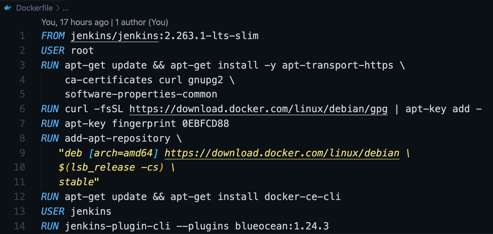

# Inception

This is a project/POC I made as a part of Developer Essentials. It contains various things that I learned along the part.

Although I was suppoesed to just do 2 courses and make 1 POC, I ended up mixing a lot of things and linking each with the other.

Thus calling it an __Inception__


The folder structure for this repository is very simple:

```
.
├── Dockerfile
├── Presentation.md
├── Images/
└── README.md
```

1. `Dockerfile` - This file contains the instructions to make the docker image.
2. `Presentation.md` - This is the presentation file that I will be presenting.
3. `Images/` - This is the images folder for the images to be used in `README` and `Presentation`.
4. `README.md` - This is the readme file.

## Docker and Dockerfile

This is the story of what happens behind the scenes for making a docker image and how it is made. So lets start.



1. `FROM` - This is the image that we fetch from the [Dockerhub](https://hub.docker.com/). For my case, I used a `jenkins` docker image.
2. `USER` - Here we define the type of user that will carry out the further steps in the dockerfile.
3. `RUN` - This contains the commands we run in the terminal of inside the docker image.

Coming to the Dockerfile. Here the steps that took place:
1. First of all it fetches the jenkins image from the docker hub.
2. After that we set the user as root
3. Then we install the minimum required dependencies for `docker-ce-cli` and install it on our container.
4. Then we download the `docker` for linux and install `docker-ce-cli`.
5. Once the installation is done, we set the user as jenkins and install the required plugins required. Here I am using the `blueocean` plugin as it gives a better UI to create pipelines and jobs. You can read more about it [here](https://plugins.jenkins.io/blueocean/).

I am using an exisiting Node.js project of mine to integrate it with jenkins. It is a Weather App - [Weather Website Node](https://github.com/khanna98/Weather-Website-Node).

I will be discussing about it later but before that lets discuss how I ran jenkins in docker and hosted it on GCP.

## Journey of Jenkins -> Docker -> GCP

1. [Create Kuberntes Cluster](https://cloud.google.com/kubernetes-engine/docs/tutorials/hello-app#cloud-shell_1)
2. [Region & Zones for Kubernetes](https://cloud.google.com/compute/docs/regions-zones#available)
3. [Kubernetes Engine](https://console.cloud.google.com/kubernetes/clusters/details/us-east4-a/hello-cluster?authuser=4&project=manifest-audio-293211&tab=details&persistent_volumes_tablesize=50&storage_class_tablesize=50&nodes_tablesize=50&node_pool_tablesize=10)
4. [Logs for Kuberntes Cluster](https://console.cloud.google.com/logs/query;query=resource.type%3D%22k8s_container%22%0Aresource.labels.project_id%3D%22manifest-audio-293211%22%0Aresource.labels.location%3D%22us-east4-a%22%0Aresource.labels.cluster_name%3D%22hello-cluster%22%0Aresource.labels.namespace_name%3D%22default%22%0Alabels.k8s-pod%2Fapp%3D%22jenkins-docker-app%22;timeRange=PT1H?authuser=4&project=manifest-audio-293211)

The jenkins is running in a Docker Container on Kubernetes on the Private IP: [Private IP](http://35.245.21.71/)